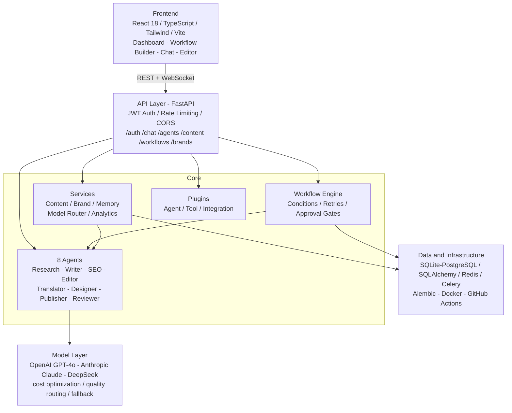

<div align="center">

# AI Content OS

### Multi-agent AI content creation platform with visual workflows, 8 specialized agents, and real-time collaboration

[](https://github.com/WAHIB-EL-KHADIRI/ai_content_factory/actions/workflows/ci.yml)
[](https://www.python.org/downloads/)
[](https://fastapi.tiangolo.com/)
[](https://react.dev/)
[](https://www.typescriptlang.org/)
[](https://opensource.org/licenses/MIT)
[](https://github.com/WAHIB-EL-KHADIRI/ai_content_factory/actions/workflows/ci.yml)

---

**AI Content OS** is an open-source, multi-agent content creation platform that orchestrates 8 specialized AI agents through visual workflows to research, write, optimize, translate, design, and publish content — all with brand consistency, cost control, and real-time streaming.

</div>

---

## Features

| Feature | Description |
|---------|-------------|
| **8 AI Agents** | Research, Writer, SEO, Editor, Translator, Designer, Publisher, Reviewer — each a specialist |
| **Visual Workflow Builder** | Drag-and-drop pipelines with conditions, retries, parallelism, and human approval gates |
| **Multi-Model Routing** | Intelligent selection across GPT-4o, Claude, and DeepSeek based on task, cost, and quality |
| **Real-Time Streaming Chat** | WebSocket-powered chat with streaming LLM responses and agent collaboration |
| **Brand Consistency Engine** | Define voice, tone, style guides, and vocabulary — enforced across all content |
| **RAG-Powered Research Studio** | Upload documents, build knowledge bases, and ground AI responses in your data |
| **Background Task Queue** | Async job processing for long-running workflows and batch operations |
| **WebSocket Real-Time Updates** | Live progress, status, and streaming output to any connected client |
| **Plugin System** | Extend agents, tools, workflows, and integrations with a first-class SDK |
| **Admin Dashboard** | User management, system health, cost analytics, and audit logs |
| **Dark Mode** | Full dark mode support in the React frontend |

---

## Architecture



---

## Quick Start

### With Docker (recommended)

```bash
git clone https://github.com/WAHIB-EL-KHADIRI/ai_content_factory.git
cd ai-content-os
cp .env.example .env
# Edit .env with your API keys
docker compose up -d
# Open http://localhost:3000 (frontend) or http://localhost:8000/docs (API)
```

### Manual Setup

```bash
git clone https://github.com/WAHIB-EL-KHADIRI/ai_content_factory.git
cd ai-content-os

# Backend
python -m venv venv
source venv/bin/activate  # Windows: venv\Scripts\activate
pip install -r requirements.txt
cp .env.example .env

# Start backend
python -m backend.api.app

# Frontend (separate terminal)
cd frontend
npm install
npm run dev
```

### Verify

```bash
curl http://localhost:8000/health
# {"status":"healthy","version":"1.0.0"}
```

---

## API Reference

### Authentication

```bash
# Register
curl -X POST http://localhost:8000/api/v1/auth/register \
  -H "Content-Type: application/json" \
  -d '{"username":"demo","email":"demo@example.com","password":"securepass123"}'

# Login
curl -X POST http://localhost:8000/api/v1/auth/login \
  -H "Content-Type: application/json" \
  -d '{"username":"demo","password":"securepass123"}'
```

### Chat (Streaming)

```bash
curl -X POST http://localhost:8000/api/v1/chat/stream \
  -H "Content-Type: application/json" \
  -H "Authorization: Bearer <token>" \
  -d '{"message":"Write a blog post about AI trends in 2026","model":"gpt-4o"}'
```

### Content Creation

```bash
curl -X POST http://localhost:8000/api/v1/content \
  -H "Content-Type: application/json" \
  -H "Authorization: Bearer <token>" \
  -d '{
    "project_id": "my-project",
    "topic": "The Future of AI in Healthcare",
    "content_type": "article",
    "word_count": 1500
  }'
```

### Agent Execution

```bash
curl -X POST http://localhost:8000/api/v1/agents/run \
  -H "Content-Type: application/json" \
  -H "Authorization: Bearer <token>" \
  -d '{"agent_role":"seo","task":{"action":"keywords","topic":"AI healthcare"}}'
```

### Workflow Management

```bash
# Create from template
curl -X POST "http://localhost:8000/api/v1/workflows/templates/article?topic=AI+in+Healthcare" \
  -H "Authorization: Bearer <token>"

# Execute workflow
curl -X POST http://localhost:8000/api/v1/workflows/run \
  -H "Content-Type: application/json" \
  -H "Authorization: Bearer <token>" \
  -d '{"workflow_id":"<id>","context":{"project_id":"my-project"}}'
```

### Brand Management

```bash
curl -X POST http://localhost:8000/api/v1/brands \
  -H "Content-Type: application/json" \
  -H "Authorization: Bearer <token>" \
  -d '{"name":"Acme Corp","voice":"professional","tone":"friendly","style_guide":"Use simple language"}'
```

> Full interactive API docs at **http://localhost:8000/docs** (Swagger) and **http://localhost:8000/redoc** (ReDoc).

---

## Agents

| Agent | Role | What It Does |
|-------|------|--------------|
| Research | `research` | Gathers information, analyzes topics, and synthesizes findings |
| Writer | `writer` | Creates articles, scripts, social posts, and long-form content |
| SEO | `seo` | Keyword research, on-page optimization, meta tag generation |
| Editor | `editor` | Grammar, style, clarity, tone consistency, and restructuring |
| Translator | `translator` | Multi-language translation with cultural localization |
| Designer | `designer` | Visual content concepts, image prompt generation, layout suggestions |
| Publisher | `publisher` | Platform-specific formatting, scheduling, and distribution |
| Reviewer | `reviewer` | Quality assurance, fact-checking, compliance, and final approval |

---

## Tech Stack

| Layer | Technology | Purpose |
|-------|-----------|---------|
| **Backend** | FastAPI, SQLAlchemy, Celery-compatible | Async REST API with ORM and task queue |
| **Frontend** | React 18, TypeScript, Tailwind CSS, Vite | Modern SPA with type safety and fast builds |
| **AI Models** | OpenAI, Anthropic, DeepSeek | Multi-provider model routing and fallbacks |
| **Database** | SQLite (dev) / PostgreSQL (prod) | Relational storage with Alembic migrations |
| **Cache/Queue** | Redis | Background job processing and caching |
| **Infrastructure** | Docker, Docker Compose | Containerized development and deployment |
| **CI/CD** | GitHub Actions | Automated testing, linting, and deployment |
| **Code Quality** | Ruff, MyPy, Pytest | Linting, type checking, and testing |

---

## Project Structure

```
ai-content-os/
├── backend/
│   ├── api/                # FastAPI routes, middleware, WebSocket
│   ├── core/               # Configuration, auth, security
│   ├── db/                 # SQLAlchemy models and repositories
│   ├── agents/             # 8 specialized AI agents
│   ├── services/           # Business logic (content, brand, memory)
│   ├── workflows/          # Workflow engine, builder, conditions
│   ├── analytics/          # Cost tracking, usage metrics
│   └── plugins/            # Plugin SDK and registry
├── frontend/
│   ├── src/
│   │   ├── components/     # React UI components
│   │   ├── pages/          # Route pages
│   │   └── hooks/          # Custom React hooks
│   ├── package.json
│   └── vite.config.ts
├── tests/
│   ├── unit/               # Unit tests
│   ├── integration/        # Integration tests
│   └── e2e/                # End-to-end tests
├── docker/                 # Docker configuration
├── .github/workflows/      # CI/CD pipelines
├── docs/                   # Documentation
├── alembic/                # Database migrations
├── docker-compose.yml
├── requirements.txt
└── .env.example
```

---

## Configuration

All configuration is managed via environment variables. Copy `.env.example` to `.env` and set your keys:

| Variable | Description | Required |
|----------|-------------|----------|
| `OPENAI_API_KEY` | OpenAI API key | Yes |
| `ANTHROPIC_API_KEY` | Anthropic API key | No |
| `DEEPSEEK_API_KEY` | DeepSeek API key | No |
| `DATABASE_URL` | Database connection string | Yes |
| `SECRET_KEY` | Application secret for JWT | Yes |
| `REDIS_URL` | Redis connection for task queue | No |

---

## Testing

```bash
# Unit tests
pytest tests/unit/ -v

# Integration tests
pytest tests/integration/ -v

# All tests with coverage
pytest tests/ -v --cov=backend

# Lint and type check
ruff check backend/
mypy backend/
```

---

## Contributing

See [CONTRIBUTING.md](CONTRIBUTING.md) for development setup, code style, and PR guidelines.

---

## License

MIT License — see [LICENSE](LICENSE) for details.

---

<div align="center">

Built and maintained by [WAHIB EL KHADIRI](https://github.com/WAHIB-EL-KHADIRI).
Bugs, feature requests and questions all go to
[Issues](https://github.com/WAHIB-EL-KHADIRI/ai_content_factory/issues).

</div>