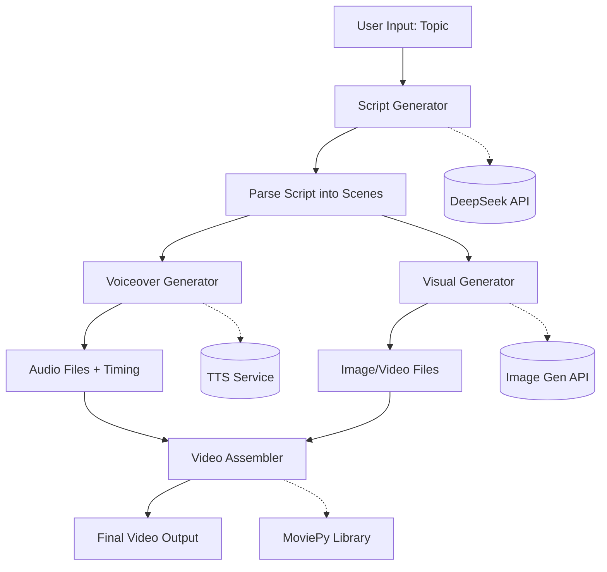
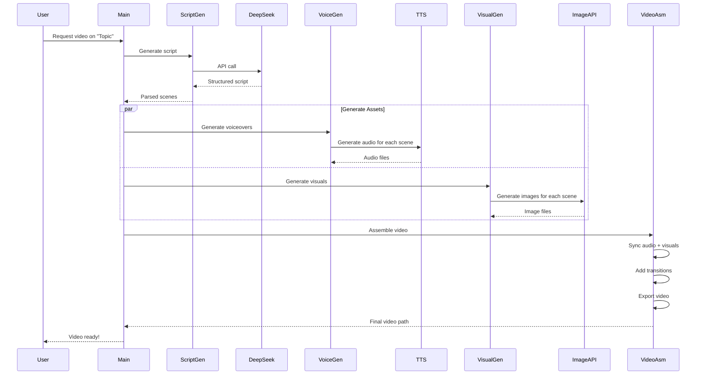

# AI Video Generation System - Architecture

## Overview

This system automatically generates video content from a simple topic input using AI services for script writing, voiceover, and visuals, then assembles everything into a final video.

## System Flow



## Component Architecture

### 1. Script Generator
**Purpose**: Generate structured video scripts from topics

**Input**:
- Topic (string): e.g., "History of Coffee"
- Style preferences (optional): educational, documentary, entertaining

**Process**:
- Calls DeepSeek API with carefully crafted prompt
- Requests structured output with scenes
- Each scene includes:
  - Narration text
  - Visual description
  - Estimated duration

**Output**:
```json
{
  "title": "The History of Coffee",
  "scenes": [
    {
      "id": 1,
      "narration": "Coffee's journey began in Ethiopia...",
      "visual_prompt": "Ancient Ethiopian coffee forests, lush green beans",
      "duration": 8
    },
    {
      "id": 2,
      "narration": "By the 15th century...",
      "visual_prompt": "Historical Middle Eastern coffee house, bustling scene",
      "duration": 7
    }
  ]
}
```

---

### 2. Voiceover Generator
**Purpose**: Convert script narration to audio

**Input**:
- Scene narration text
- Voice settings (voice ID, speed, pitch)

**Process**:
- For each scene:
  - Call TTS API with narration text
  - Download and save audio file
  - Calculate actual audio duration
- Cache audio files to avoid regeneration

**Output**:
- Audio files: `cache/audio/scene_1.mp3`, `scene_2.mp3`, etc.
- Timing data: actual duration of each audio clip

---

### 3. Visual Generator
**Purpose**: Generate images/videos for each scene

**Input**:
- Scene visual prompts
- Video settings (resolution, aspect ratio)

**Process**:
- For each scene:
  - Enhance visual prompt with quality modifiers
  - Call image generation API
  - Download and save image
  - Optional: Apply slow zoom/pan effect
- Cache images to avoid regeneration

**Output**:
- Image files: `cache/images/scene_1.png`, `scene_2.png`, etc.

---

### 4. Video Assembler
**Purpose**: Combine audio and visuals into final video

**Input**:
- Audio files with timing
- Image files
- Scene metadata
- Video settings (resolution, fps, transitions)

**Process**:
1. For each scene:
   - Load image as video clip (with duration from audio)
   - Apply slow zoom/pan effect (Ken Burns effect)
   - Attach corresponding audio
2. Add transitions between scenes (crossfade)
3. Optional: Add background music at low volume
4. Optional: Add text overlays (title, subtitles)
5. Concatenate all scenes
6. Export final video

**Output**:
- Final video file: `output/history_of_coffee.mp4`

---

## Data Flow



---

## Technology Stack

### Core Technologies
- **Language**: Python 3.9+
- **Video Library**: MoviePy
- **HTTP Client**: requests / httpx

### AI Services
- **Script Generation**: DeepSeek API
- **Text-to-Speech**: Configurable (ElevenLabs, Azure, Google, or Coqui)
- **Image Generation**: Configurable (DALL-E 3, Stability AI, or local SD)

### Additional Libraries
- **Configuration**: PyYAML
- **CLI**: argparse or click
- **Logging**: Python logging module
- **Image Processing**: Pillow (PIL)

---

## Directory Structure

```
ai_content_factory/
├── main.py                 # Main orchestrator
├── config.yaml             # Configuration file
├── requirements.txt        # Python dependencies
├── README.md               # Documentation
│
├── modules/
│   ├── __init__.py
│   ├── script_generator.py     # DeepSeek integration
│   ├── prompts.py              # Prompt templates
│   ├── voiceover_generator.py  # TTS integration
│   ├── visual_generator.py     # Image generation
│   ├── video_assembler.py      # MoviePy video creation
│   └── utils.py                # Shared utilities
│
├── cache/
│   ├── audio/              # Generated audio files
│   └── images/             # Generated images
│
└── output/                 # Final video outputs
```

---

## Configuration Format

```yaml
# API Keys
deepseek:
  api_key: "your-deepseek-api-key"
  model: "deepseek-chat"

tts:
  provider: "elevenlabs"  # or "azure", "google", "coqui"
  api_key: "your-tts-api-key"
  voice_id: "default-voice-id"
  settings:
    stability: 0.5
    similarity_boost: 0.75

image_generation:
  provider: "openai"  # or "stability", "local"
  api_key: "your-openai-api-key"
  model: "dall-e-3"
  settings:
    size: "1792x1024"
    quality: "hd"

# Video Settings
video:
  resolution: [1920, 1080]
  fps: 30
  transition_duration: 1.0
  background_music: null  # path to music file or null

# Paths
paths:
  cache_dir: "cache"
  output_dir: "output"
```

---

## Error Handling Strategy

1. **API Failures**: Implement retry logic with exponential backoff
2. **Invalid Responses**: Validate JSON schemas, fallback to defaults
3. **File Operations**: Check disk space, handle permissions
4. **Resource Cleanup**: Clean up temporary files on error
5. **Logging**: Comprehensive logging at each step for debugging

---

## Performance Considerations

1. **Caching**: Cache generated audio and images to avoid regeneration
2. **Parallel Processing**: Generate voiceovers and visuals concurrently
3. **Lazy Loading**: Load video clips only when needed
4. **Compression**: Use efficient video codecs (H.264)
5. **Resource Limits**: Monitor memory usage, process large videos in chunks

---

## Future Enhancements

- [ ] Support for video clips (not just images)
- [ ] Background music with auto-ducking
- [ ] Subtitle generation and embedding
- [ ] Multiple voice actors for dialogues
- [ ] Custom transition effects
- [ ] Video editing (trimming, filters)
- [ ] Batch processing multiple topics
- [ ] Web UI for easier interaction
